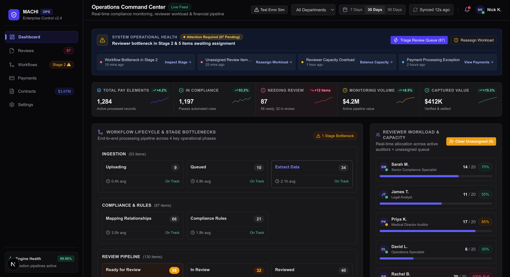
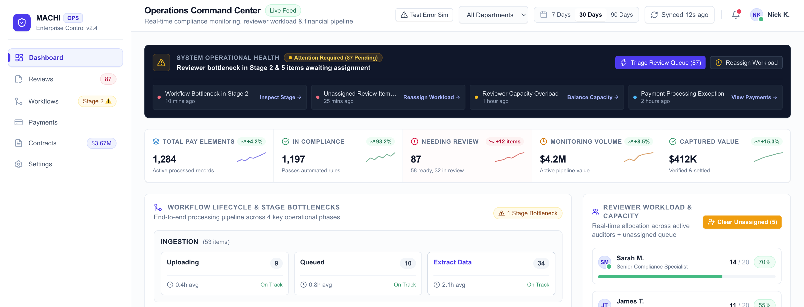

<div align="center">
  <br />
  <a href="https://enterprise-saas-dashboard-mt.vercel.app/" target="_blank">
    
    </a>
    <a href="https://enterprise-saas-dashboard-mt.vercel.app/" target="_blank">
    
    </a>
  <br />

  <div>
    
    
    

    
  </div>


# Enterprise SaaS Operations Dashboard

## Overview

A modern B2B operational dashboard built for administrative users to monitor system health, identify processing bottlenecks, triage pending compliance reviews, and track financial activity. Rebuilt from a legacy single-screen reference to demonstrate improved visual hierarchy, data isolation, caching strategies, and feature-based frontend architecture.

## Tech Stack

- **Framework**: Next.js 16 (App Router)
- **UI & Logic**: React 19, TypeScript
- **Styling**: Tailwind CSS v4, shadcn/ui primitives
- **Data Fetching**: TanStack React Query v5
- **State Management**: Redux Toolkit (Starter Setup) + React Context
- **Charts**: Recharts
- **Icons**: Lucide React
- **Testing**: Vitest

## Getting Started

### Prerequisites
- Node.js `v18.0.0` or higher (Tested on Node `v26.3.1`)
- npm `v9.0.0` or higher

### Installation & Commands

1. **Install Dependencies**:
   ```bash
   npm install
   ```

2. **Start Development Server**:
   ```bash
   npm run dev
   ```
   Open [http://localhost:3000](http://localhost:3000) in your browser.

3. **Run Type Check & Linter**:
   ```bash
   npx tsc --noEmit
   npm run lint
   ```

4. **Run Unit Tests**:
   ```bash
   npm test
   ```

5. **Build for Production**:
   ```bash
   npm run build
   ```

6. **Start Production Server**:
   ```bash
   npm run start
   ```

---

## Architecture

The project uses a **Feature-Oriented Architecture** to keep presentation, business logic, data fetching, and types co-located by domain.

```
src/
├── app/
│   ├── api/             # Next.js App Router mock API endpoints
│   ├── layout.tsx        # Server Component layout wrapper with Providers
│   ├── page.tsx          # Server Component composing static layout & client workspace
│   └── globals.css       # Tailwind CSS design tokens
├── components/
│   ├── ui/               # Customized primitive components (Button, Card, Table, Sheet, etc.)
│   └── layout/           # Shared shell layout components (Sidebar, Header)
├── context/
│   └── DashboardFilterContext.tsx # Reactive client context for date/dept filters
├── features/
│   ├── dashboard/        # Operational Status Bar & Exception Ticker
│   ├── kpis/             # Metric Ribbon & Sparkline Trend indicators
│   ├── workflow/         # Stage-Gate Pipeline & Bottleneck Flags
│   ├── reviewers/        # Reviewer Workload Balancer & Reassignment Modal
│   ├── reviews/          # Review Queue Table & Detail Slide-Over Drawer
│   ├── payments/         # Payments Out Aging Bar Chart (Recharts)
│   └── contracts/        # Contract Category Distribution Progress Bars
├── hooks/
│   └── useDashboardQueries.ts # TanStack Query custom hooks
├── lib/
│   ├── api/              # Decoupled API service client wrapper
│   ├── query/            # Query key factory tuple definitions
│   ├── mock-data.ts      # Domain dataset for backend endpoints
│   └── utils.ts          # Formatting utilities
├── store/
│   ├── index.ts          # Redux Toolkit store setup & typed hooks (useAppDispatch, useAppSelector)
│   └── slices/           # Redux slices (uiSlice.ts)
└── types/                # Dedicated TypeScript Contracts
    ├── domain.ts         # Domain interfaces
    ├── api.ts            # API request/response contracts
    └── index.ts          # Barrel export
```

---

## Data Architecture

Data flows strictly through decoupled boundaries:

```
UI Component
  ↓
Feature Query Hook (e.g., useReviews)
  ↓
API Service Client (src/lib/api/client.ts)
  ↓
Next.js App Router Mock Endpoints (src/app/api/*)
  ↓
Mock Repository (src/lib/mock-data.ts)
```

UI components never import raw JSON files or construct HTTP endpoint URLs directly. To replace the mock layer with a real backend, only `src/lib/api/client.ts` needs to point to real REST endpoints without modifying presentation components.

---

## Data Fetching & Caching

### Independent Widget Fetching
Every widget executes its own TanStack Query request (`useKpis`, `useWorkflow`, `useReviews`, `useReviewers`, `usePayments`, `useContracts`). A slow network response or failure in Payments does not block the render or execution of KPIs, Workflow, or Review Queue.

### Query Keys
Queries use structured key tuples defined in `src/lib/query/queryKeys.ts`:
```ts
queryKeys.reviews({ dateRange: '30d', department: 'Clinical', page: 1, pageSize: 5 })
```

### Stale Times & Freshness Rationale

| Endpoint / Widget | Stale Time | Rationale |
| :--- | :--- | :--- |
| **Reviews Queue** | `20 sec` | Active compliance triage requires frequent updates as auditors complete items. |
| **Workflow Pipeline** | `30 sec` | Stage bottlenecks and SLA delays need sub-minute velocity tracking. |
| **KPI Metrics** | `60 sec` | Executive overview numbers update periodically. |
| **Reviewer Workload**| `60 sec` | Auditor capacity balance updates on a minute-by-minute basis. |
| **Payments Out** | `3 min` | Disbursement outflow trends change less frequently during operational shifts. |
| **Contract Values** | `5 min` | Agreement categories represent long-term contract structures. |

### Loading & Error Handling
- **Skeletons**: Each widget renders a dedicated `<Skeleton>` matching its layout dimensions during `isLoading`.
- **Error Retries**: Widgets handle `isError` with an isolated `<WidgetErrorState>` card featuring a **Retry Request** button calling `refetch()`.
- **Error Simulation**: Click **Test Error Sim** in the header to trigger simulated 500 error responses and demonstrate error recovery.

### Global Filters & Placeholder Data
Global date range (`7d`, `30d`, `90d`) and department selectors update query key parameters. Queries specify `placeholderData: keepPreviousData` so changing filters updates data smoothly without layout flicker.

### Pagination & Prefetching
- The Review Queue table uses server-style pagination (`5 items per page`).
- When Page `N` renders, `queryClient.prefetchQuery` pre-loads Page `N + 1` in the background for zero-latency pagination transitions.

---

## Performance

- **Lazy Loading**: Below-the-fold chart modules (`PaymentAnalytics` and `ContractValue`) are lazy-loaded using `next/dynamic` with Suspense fallback skeletons.
- **Narrow Client Boundaries**: Static layout frames render on the server (`app/page.tsx`), keeping client hydration boundaries confined to interactive widgets.

---

## Accessibility

- **Keyboard Navigation**: Dialogs (`<Dialog>`) and drawers (`<Sheet>`) close on `Escape` key and prevent background scroll.
- **Semantic HTML**: Standard `<table>`, `<thead>`, `<tbody>`, `<button>`, and `<select>` elements used throughout.
- **Color Independence**: Priority and status badges pair color tags with explicit text (`🔥 High Priority`, `⚠️ Bottleneck`, `4d active`).

---

## Redux Toolkit Starter Setup

Installed `@reduxjs/toolkit` and `react-redux` to provide a scalable state management architecture for future complex operational state expansion:
- `src/store/index.ts`: Configures store and exports typed hooks (`useAppDispatch`, `useAppSelector`).
- `src/store/slices/uiSlice.ts`: Starter slice managing active tabs, modal toggles, and sidebar state.
- Integrated into `src/app/providers.tsx` via `<ReduxProvider store={store}>`.

---

## Trade-offs

- **Client Context vs. URL State**: Used `DashboardFilterContext` for managing global filter state instead of sync URL search params. This kept state management straightforward without adding router listener overhead for a single-page dashboard.
- **Mock Latency**: Simulated fixed delays (200ms–400ms) rather than full WebSocket streaming to focus effort on query caching and UI state transitions.

---

## With More Time

1. **Optimistic Mutations**: Implement optimistic updates on review item approval and workload reassignment.
2. **Saved Filter Presets**: Allow operators to save custom filter combinations (e.g., "Urgent Clinical Reviews").
3. **CSV Data Export**: Add a downloadable export feature for filtered review queue items.
